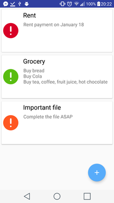

# SmoothList

 

# What is it ?
A Smooth &amp; Simple ToDoList

# How to use it ?
Just download the project open with `Android Studio` and compile it and run it on your phone.
Or you can compile it and get the apk file on this folder : `$PROJECT_PATH/SmoothList/app/build/outputs/apk/app-debug.apk`

# Screenshots

 
